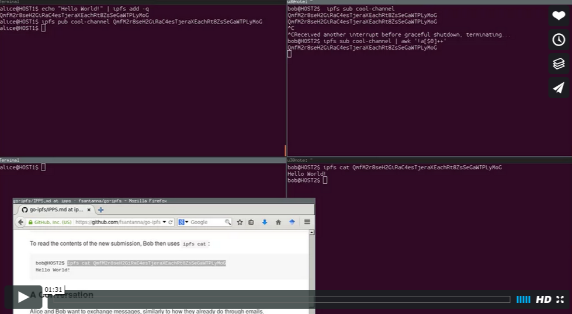
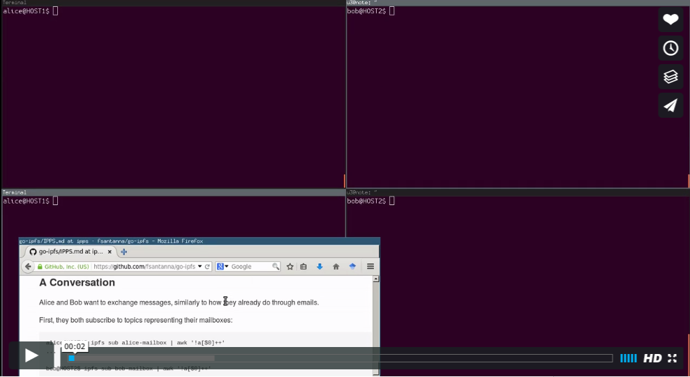
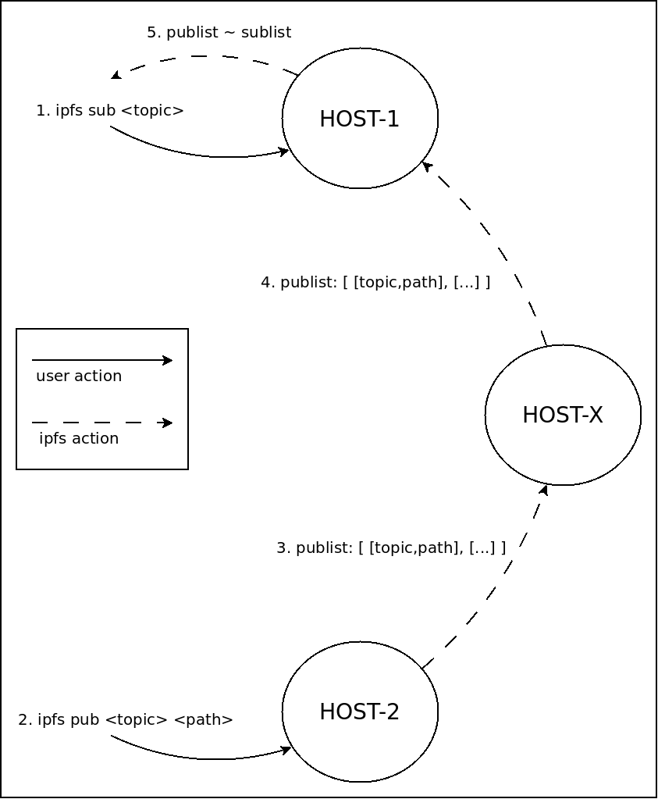

# IPPS: Pub/Sub functionality for IPFS

The *Publish-Subscribe Pattern*:

> In software architecture, *publish-subscribe* is a messaging pattern where 
> senders of messages, called publishers, do not program the messages to be 
> sent directly to specific receivers, called subscribers, but instead 
> characterize published messages into classes without knowledge of which 
> subscribers, if any, there may be. Similarly, subscribers express interest in 
> one or more classes and only receive messages that are of interest, without 
> knowledge of which publishers, if any, there are.

(Definition from Wikipedia.)

Currently, there is no *pub/sub* mechanism available for IPFS users because 
there is no easy way to broadcast (or listen to) file submissions.

IPFS is *pull-driven* and not *push-driven*, i.e., you cannot say to the world 
"hey, look at this new cat picture".

We propose (and implement) two new commands to provide *pub/sub* for IPFS:

```
$ ipfs pub <topic-string> <ipfs-path>

$ ipfs sub <topic-string>
	<ipfs-path-1>
	...
	<ipfs-path-2>
	...
```

The command `ipfs pub` reads as

> Broadcast the file `<ipfs-path>` to all subscribers of `<topic-string>`.

The command `ipfs sub` reads as

> Whenever someone broadcasts a new file to `<topic-string>`, output its 
> `<ipfs-path>`.

We employ best-effort delivery, with no guarantees that publishers reach their 
subscribers.

This is an exercise.
Although we believe the proposed/desired API is powerful and generic for many 
[applications](#examples), the proposed [implementation](#implementation) is 
naive and does not scale.
Therefore, the goal with this exercise is to question its feasibility:

> Is it possible to provide a scalable `ipfs sub` and `ipfs pub` API for end 
> users?

## Examples

### Hello World!

<a href="https://player.vimeo.com/video/149632333" target="_blank">

</a>

Alice at `HOST1` wants to publish the message `Hello World!` to all 
subscribers of the topic `cool-channel`.

(Click the image in the right to open a screencast of this example in a new 
window.)

First, Alice adds the message with `ipfs add` and acquires the corresponding 
path:

```
alice@HOST1$ echo "Hello World!" | ipfs add -q
QmfM2r8seH2GiRaC4esTjeraXEachRt8ZsSeGaWTPLyMoG
```

Then, Alice publishes the path to `cool-channel`:

```
alice@HOST1$ ipfs pub cool-channel QmfM2r8seH2GiRaC4esTjeraXEachRt8ZsSeGaWTPLyMoG
```

Bob, at `HOST2`, wants to be notified about new files published to the topic 
`cool-channel`:

```
bob@HOST2$ ipfs sub cool-channel
QmfM2r8seH2GiRaC4esTjeraXEachRt8ZsSeGaWTPLyMoG
QmfM2r8seH2GiRaC4esTjeraXEachRt8ZsSeGaWTPLyMoG
...
```

Every time someone publishes a new file to `cool-channel`, Bob is notified with 
the hash of the new file.

Bob can avoid duplicate notifications as follows:

```
bob@HOST2$ ipfs sub cool-channel | awk '!a[$0]++'
QmfM2r8seH2GiRaC4esTjeraXEachRt8ZsSeGaWTPLyMoG
...
```

To read the contents of the new submission, Bob then uses `ipfs cat`:

```
bob@HOST2$ ipfs cat QmfM2r8seH2GiRaC4esTjeraXEachRt8ZsSeGaWTPLyMoG
Hello World!
```

### A Conversation

<a href="https://player.vimeo.com/video/149634615" target="_blank">

</a>

Alice and Bob want to exchange messages, similarly to how they already do 
through emails.

(Click the image in the right to open a screencast of this example in a new 
window.)

First, they both subscribe to topics representing their mailboxes:

```
alice@HOST1$ ipfs sub alice-mailbox | awk '!a[$0]++'
...

bob@HOST2$ ipfs sub bob-mailbox | awk '!a[$0]++'
...
```

A conversation is a directory defining a "protocol" with certain predefined 
files, e.g., `from`, `to`, and `message`:

```
alice@HOST1$ mkdir to-bob
alice@HOST1$ echo Alice > to-bob/from
alice@HOST1$ echo Bob > to-bob/to
alice@HOST1$ echo -e "Hello Bob,\nTalk to me.\nAlice" > to-bob/message
```

Alice publishes the conversation to `bob-mailbox`:

```
alice@HOST1$ ipfs add -r to-bob/
added QmXFyfUEXXNY13e7W15nEMDkZyuS2UqkiKQBxc6DHdqPbH to-bob/from
added QmYUTBNbN8wcEwGmoFQZhxKhnnRY6dZR32Fu5DvFGz3j2r to-bob/message
added QmYckDL4bLcDUBDG2XLhcTWTQbJGnigUZpzCRRC2rzJthE to-bob/to
added QmYJKvMFLyzbHYhxpLk2Xd6h8okoHNwmpLMBXu2gxqiRdp to-bob
alice@HOST1$ ipfs pub bob-mailbox QmYJKvMFLyzbHYhxpLk2Xd6h8okoHNwmpLMBXu2gxqiRdp
```

Bob receives the notification:

```
bob@HOST2$ ipfs sub bob-mailbox | awk '!a[$0]++'
QmYJKvMFLyzbHYhxpLk2Xd6h8okoHNwmpLMBXu2gxqiRdp
```

Bob reads the message:

```
bob@HOST2$ ipfs get QmYJKvMFLyzbHYhxpLk2Xd6h8okoHNwmpLMBXu2gxqiRdp
Saving file(s) to QmYJKvMFLyzbHYhxpLk2Xd6h8okoHNwmpLMBXu2gxqiRdp
4.50 KB 0
bob@HOST2$ cat QmYJKvMFLyzbHYhxpLk2Xd6h8okoHNwmpLMBXu2gxqiRdp/from
Alice
bob@HOST2$ cat QmYJKvMFLyzbHYhxpLk2Xd6h8okoHNwmpLMBXu2gxqiRdp/to
Bob
bob@HOST2$ cat QmYJKvMFLyzbHYhxpLk2Xd6h8okoHNwmpLMBXu2gxqiRdp/message
Hello Bob,
Talk to me.
Alice
```

Bob replies the message, keeping a *backlink* to the original message in the 
directory `previous`:

```
bob@HOST2$ mkdir to-alice
bob@HOST2$ mv QmYJKvMFLyzbHYhxpLk2Xd6h8okoHNwmpLMBXu2gxqiRdp/ to-alice/previous/
bob@HOST2$ echo Bob > to-alice/from
bob@HOST2$ echo Alice > to-alice/to
bob@HOST2$ echo -e "Hello Alice,\nThanks for your message.\nBob" > to-alice/message
```

Bob publishes the reply to `alice-mailbox`:

```
bob@HOST2$ ipfs add -r to-alice/
added QmYckDL4bLcDUBDG2XLhcTWTQbJGnigUZpzCRRC2rzJthE to-alice/from
added QmPM2AcPzodjy8ViRSahVPv84WLqfFGzW9SmtWFqeaNMQf to-alice/message
added QmXFyfUEXXNY13e7W15nEMDkZyuS2UqkiKQBxc6DHdqPbH to-alice/previous/from
added QmYUTBNbN8wcEwGmoFQZhxKhnnRY6dZR32Fu5DvFGz3j2r to-alice/previous/message
added QmYckDL4bLcDUBDG2XLhcTWTQbJGnigUZpzCRRC2rzJthE to-alice/previous/to
added QmYJKvMFLyzbHYhxpLk2Xd6h8okoHNwmpLMBXu2gxqiRdp to-alice/previous
added QmXFyfUEXXNY13e7W15nEMDkZyuS2UqkiKQBxc6DHdqPbH to-alice/to
added QmQHioEDdCc6G4G4XsAUs2a2Uq6euuzAhf9Ym2bGHfFL2a to-alice
bob@HOST2$ ipfs pub alice-mailbox QmQHioEDdCc6G4G4XsAUs2a2Uq6euuzAhf9Ym2bGHfFL2a
```

Alice receives the notification:

```
alice@HOST1$ ipfs sub alice-mailbox | awk '!a[$0]++'
QmQHioEDdCc6G4G4XsAUs2a2Uq6euuzAhf9Ym2bGHfFL2a
```

Alice reads the reply, also re-reading her original message:

```
alice@HOST1$ ipfs get QmQHioEDdCc6G4G4XsAUs2a2Uq6euuzAhf9Ym2bGHfFL2a
Saving file(s) to QmQHioEDdCc6G4G4XsAUs2a2Uq6euuzAhf9Ym2bGHfFL2a
8.00 KB 0
alice@HOST1$ cat QmQHioEDdCc6G4G4XsAUs2a2Uq6euuzAhf9Ym2bGHfFL2a/message
Hello Alice,
Thanks for your message.
Bob
alice@HOST1$ cat QmQHioEDdCc6G4G4XsAUs2a2Uq6euuzAhf9Ym2bGHfFL2a/previous/message
Hello Bob,
Talk to me.
Alice
```

Conversations can become private through public-key cryptography.

<!--
### A Simple Blockchain

TBD.
-->

## Implementation

The current implementation is the
[*simplest thing that could possibly work*](http://c2.com/cgi/wiki?DoTheSimplestThingThatCouldPossiblyWork).



We assume that publishers and subscribers do not know each other and are not 
directly connected in the peer-to-peer network.
The figure in the right illustrates the general idea:

1. Node keeps its list of subscribed topics, `sublist`, from calls to `ipfs sub`.
2. Node keeps its list of published items, `publist`, from calls to `ipfs pub`.
3. Node periodically broadcasts its `publist` to connected peers.
4. Node appends received `publists` to its own `publist`.
5. Whenever `sublist` has an intersection with `publist`, Node redirects it to 
corresponding `ipfs sub`.

Eventually, all nodes receive all `publists` in the network.

Except for steps `1` and `5`, this behavior is similar to the one described for 
`wantlists` in the
[IPFS whitepaper](https://github.com/ipfs/papers/raw/master/ipfs-cap2pfs/ipfs-p2p-file-system.pdf)
, Section 3.4.4.

### Testing

Re-compile `ipfs`:

```
$ go get github.com/fsantanna/go-ipfs
$ cd $GOPATH/src/github.com/fsantanna/go-ipfs/
$ git checkout ipps
$ make install
$ which $GOPATH/bin/ipfs
```

Create three new users:

```
$ sudo adduser alice
$ sudo adduser bob
$ sudo adduser router
```

The `router` user lies in between `alice` and `bob` (i.e., `HOST-X` in the 
figure above) to assert that `publist` really propagates.

Switch to each user at a time, execute `ipfs init`, and edit `~/.ipfs/config`:

```
$ su - router
$ ipfs init
$ vi ~/.ipfs/config
```

Change all ports in `Addresses` so that they do not conflict:

```
  "Addresses": {
    "Swarm": [
      "/ip4/0.0.0.0/tcp/4003",
      "/ip6/::/tcp/4003"
    ],
    "API": "/ip4/127.0.0.1/tcp/5003",
    "Gateway": "/ip4/127.0.0.1/tcp/8083"
  },
```

Change the `Bootstrap` nodes to form the topology in the figure above:

```
  "Bootstrap": [
	"/ip4/127.0.0.1/tcp/4001/ipfs/<alice-addr>",
	"/ip4/127.0.0.1/tcp/4002/ipfs/<bob-addr>"
  ],
```

Now you are ready to run the [examples](#examples) above:

```
$ /data/go/bin/ipfs daemon
Initializing daemon...
Swarm listening on /ip4/127.0.0.1/tcp/4003
Swarm listening on /ip4/192.168.1.104/tcp/4003
Swarm listening on /ip6/::1/tcp/4003
API server listening on /ip4/127.0.0.1/tcp/5003
Gateway (readonly) server listening on /ip4/127.0.0.1/tcp/8083
Daemon is ready
```

### Source Code Walkthrough

To see all changes and compare with the latest commit of the official 
repository:

```
$ git clone https://github.com/fsantanna/go-ipfs
$ git checkout no-sublist # commit with the main changes
$ git difftool fbb607dc661bfe6dcac4e875a22ff96cccfb395c
```

Main changes:

1. `core/bootstrap.go`,
   `p2p/net/swarm/swarm_dial.go`,
   `globals/globals.go`:
After `5` seconds, set the global `Has_Bootstrapped` to force a static topology 
during the execution, refusing to complete new connections.

2. `exchange/bitswap/bitswap.go`,
   `exchange/bitswap/decision/engine.go`,
   `exchange/bitswap/decision/ledger.go`,
   `exchange/bitswap/message/message.go`,
   `exchange/bitswap/message/pb/message.pb.go`,
   `exchange/bitswap/message/pb/message.proto`,
   `exchange/bitswap/publist/publist.go`,
   `exchange/bitswap/pubmanager.go`:
Manages the `publist` by mimicking the `wantlist` behavior.

3. `core/commands/root.go`
   `core/commands/pub.go`
   `core/commands/sub.go`:
The `ipfs pub` and `ipfs sub` commands.

`ipfs pub` calls `bitswap.PubPubs()` to append new `[topic,key]` pairs to the 
node's `publist`.
`ipfs sub` calls `bitswap.SubTopics()` to register a communication channel with 
`bitswap.pubSub()` for notifications.

<!--
For more scalability, peers sharing common `pubsub` interests should connect 
directly to one another.
-->

### Considerations

- `wantlist` vs `publist`:
  Is the `wantlist` propagation described in the white paper scalable?
  Given the similarities, can we make `publist` as scalable as `wantlist` 
  propagation?

- Extra `sublist`:
  Instead of (or in addition to) propagating the `publist`, we could propagate 
  the `sublist`.

- Flooding: malicious node can make millions of `ipfs pub` calls.
  How is this different than making millions of `ipfs cat` calls?

- Speed of *pub/sub*: matching *pub/sub* nodes should connect directly to one 
  another, e.g., *publist* messages could contain the source addresses, or
  using `ipns` to maintain a growing list of publishers.

- Forwarding overhead:
  Avoid forwarding items already exchanged between peers.

- Cooperation between peers:
  Publishers have interest in their messages reaching their subscribers.
  Subscribers have interest in the publishers messages.
  The `ledger` could take this into account, but would require end-to-end 
  acknowledging.
